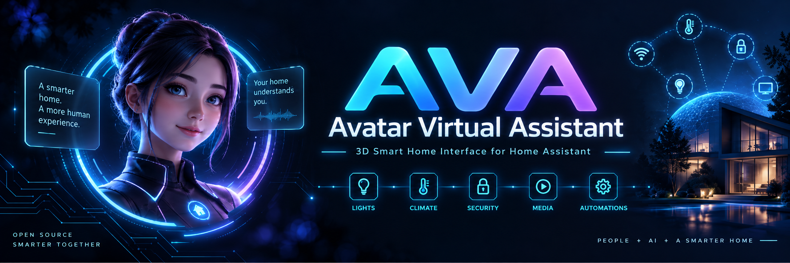
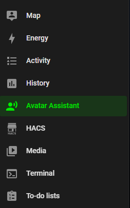
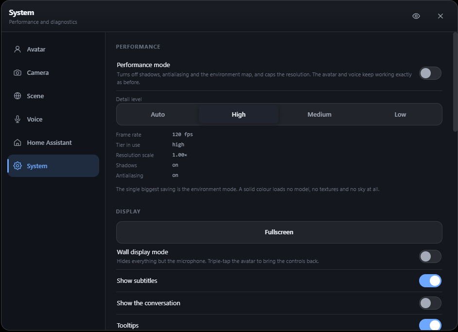
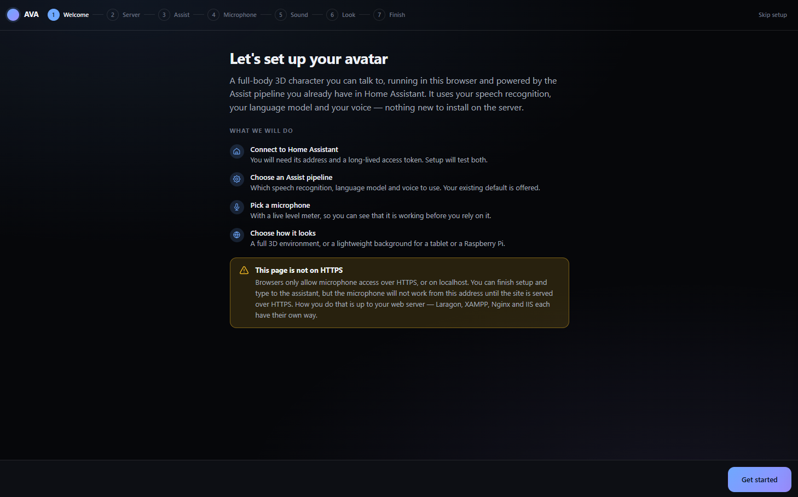
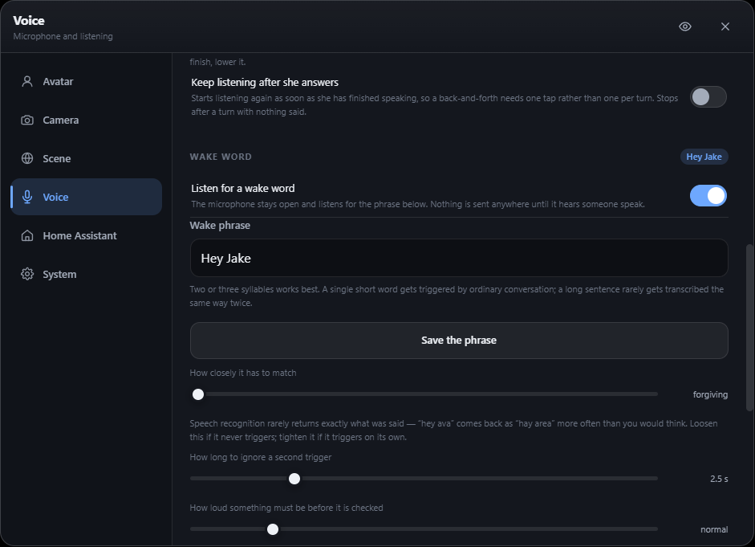
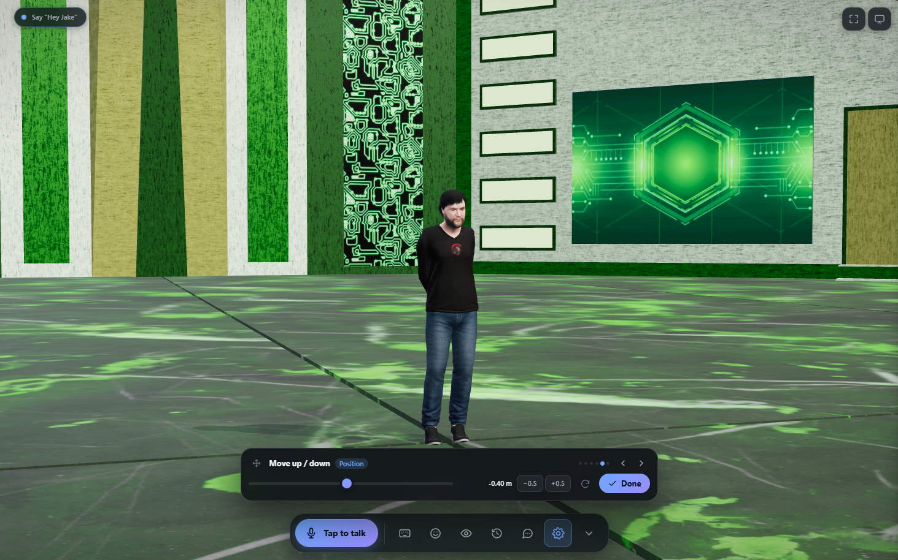
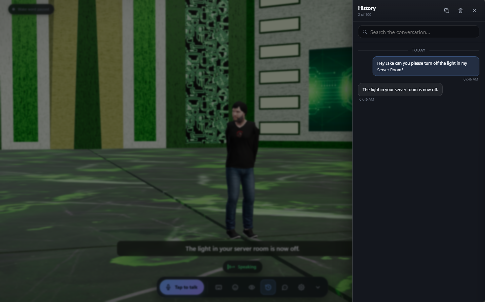

<h1>🤖AVA — Avatar Virtual Assistant</h1>

<strong>A full-body 3D talking avatar for Home Assistant.</strong> AVA gives your smart home a face, a voice and a body — powered entirely by the Assist pipeline you already run. Your speech recognition, your language model, your voice, your house. Nothing is added to the cloud, because nothing leaves your network.

Installed as a Home Assistant add-on, AVA is a single static binary with the entire web application embedded inside it. There is nothing to compile, no CDN to reach, no certificate to wire up and no reverse proxy to configure. It runs on a Raspberry Pi.

  
  
  
  

  

<h2>🔒Nothing Is Fetched From The Internet</h2>

This is the feature that matters most, and it is enforced rather than promised. Three.js, the TalkingHead lip-sync engine, the Draco mesh decoder and the stand-in avatar model are <strong>all compiled inside the binary</strong>. The browser makes exactly two kinds of outbound request: to this add-on, and to your Home Assistant. There is no third.

<ul>
  <li><strong>Works air-gapped:</strong> AVA runs on an isolated VLAN with the WAN unplugged, and keeps working when somebody else's CDN has an outage.</li>
  <li><strong>Wake word stays home:</strong> audio goes to your own Home Assistant speech-to-text engine and nowhere else. The browser's built-in speech API is deliberately unused — in Chrome it streams your microphone to Google continuously.</li>
  <li><strong>Content-Security-Policy enforced:</strong> no CDN hosts appear in <code>script-src</code>, so a library sneaking back in is blocked by the browser rather than silently working on the machine that has internet and failing on the one that does not.</li>
  <li><strong>Token never touches the browser:</strong> your Home Assistant long-lived access token is stored server-side in the add-on's <code>/data</code>, never in local storage.</li>
</ul>

  

<h2>✨Features</h2>

<ul>
  <li><strong>Full-Body 3D Avatar:</strong> A rigged humanoid model with real-time lip-sync driven by your Assist pipeline's text-to-speech output, rendered live in WebGL.</li>
  <li><strong>Tap To Talk:</strong> One tap listens and silence sends the turn. There is nothing to hold down — holding a button cannot be done with your hands full or from across a room, which is the entire reason to talk to a house.</li>
  <li><strong>Custom Wake Word:</strong> Type <em>any</em> phrase you like. It is not limited to a fixed list, because no pretrained wake word model is involved.</li>
  <li><strong>Bring Your Own Models:</strong> Drop <code>.glb</code>, <code>.gltf</code> or <code>.vrm</code> avatars and 3D environments straight in through the settings panel. They persist across restarts and updates.</li>
  <li><strong>Live Scene Placement:</strong> Every spatial control lifts out of the settings dialog onto a small draggable bar over the live scene, so you can see what you are adjusting while you adjust it.</li>
  <li><strong>Conversation History:</strong> The last 100 messages, searchable and copyable, stored on the device and never sent to the server.</li>
  <li><strong>Ingress Support:</strong> Opens from the Home Assistant sidebar inside HA's own HTTPS page — no port, no certificate warning, nothing to configure.</li>
  <li><strong>Wall Display Mode:</strong> Hides every control but the microphone, for a permanently mounted tablet.</li>
  <li><strong>Performance Mode:</strong> Caps pixel ratio and disables shadows and antialiasing for low-powered devices. Voice and the avatar keep running.</li>
  <li><strong>Single Static Binary:</strong> Installing compiles nothing. Prebuilt for three architectures, with the whole web app embedded.</li>
</ul>

  

<h2>⚙️Installation</h2>

<ol>
  <li><strong>Open the Add-on Store:</strong> In Home Assistant go to <strong>Settings → Apps</strong> (called <em>Add-ons</em> before HA 2026.2) <strong>→ App Store</strong>.</li>
  <li><strong>Add This Repository:</strong> Click the menu <strong>⋮ → Repositories</strong>, paste <code>https://github.com/BitmasterXor/AVA-Avatar-Virtual-Assistant</code> and click <strong>Add</strong>.</li>
  <li><strong>Install:</strong> Refresh the page, find <strong>AVA</strong> under <em>AVA Add-ons</em>, and click <strong>Install</strong>.</li>
  <li><strong>Start:</strong> Click <strong>Start</strong>. AVA appears in your sidebar as <strong>Avatar Assistant</strong>.</li>
</ol>

<h2>🔌First Run</h2>

Open AVA from the sidebar. A setup wizard walks you through everything and asks for two things:

<ol>
  <li><strong>Home Assistant Address:</strong> <code>http://homeassistant:8123</code> works from inside any add-on. Your LAN address (<code>http://192.168.x.x:8123</code>) works too.</li>
  <li><strong>A Long-Lived Access Token:</strong> In Home Assistant, click your name at the bottom left → the <strong>Security</strong> tab → <strong>Long-lived access tokens</strong> → create one and paste the whole string. It is stored on the server, never in the browser.</li>
</ol>

The wizard then tests your microphone, confirms your text-to-speech engine, and lets you pick an avatar and an environment before you finish.

  

<h2>🎙️Talking To Your Avatar</h2>

Tap the microphone button once and speak. When you stop talking the turn is sent automatically. Tap again to send immediately, or to stop her mid-answer.

<ul>
  <li><strong>Silence Timing:</strong> <strong>Settings → Voice</strong> tunes how long a pause counts as "finished".</li>
  <li><strong>Continuous Conversation:</strong> Turn on <em>Keep listening after she answers</em> for a back-and-forth that costs one tap rather than one per turn.</li>
  <li><strong>Echo Suppression:</strong> Stops the avatar transcribing Your Avatars own voice back. Essential on a wall tablet.</li>
  <li><strong>Text Input:</strong> Type instead of talking at any time — useful on a device with no microphone permission.</li>
</ul>

<h2>👂Wake Word</h2>

Found under <strong>Settings → Voice → Wake word</strong>. The default phrase is <code>hey ava</code>, and you can change it to anything you like.

Detection runs entirely on your own hardware. The browser gates the microphone locally on loudness, and only short candidate clips are ever sent — to the same Home Assistant speech-to-text engine that already transcribes your commands. <strong>Silence is never transmitted and nothing reaches a third party.</strong>

<h3>Tuning It</h3>
<ul>
  <li><strong>Use two syllables or more.</strong> A single short word gets triggered constantly by ordinary conversation.</li>
  <li><strong>If it never fires:</strong> loosen <em>Match strictness</em>. Speech recognition rarely returns exactly what was said — "hey ava" comes back as "hey eva" or "hey have a" more often than you would think, which is why matching is fuzzy by design.</li>
  <li><strong>If it fires on its own:</strong> raise the <em>Trigger threshold</em>. This is the setting that matters in a room with a television in it.</li>
  <li><strong>Always visible:</strong> while the wake word is armed a permanent indicator sits at the top of the screen. It has no dismiss button and it is not hidden by wall display mode.</li>
</ul>

  

<h2>🎨Placing An Avatar Or Environment</h2>

Anything spatial — size, rotation, position, camera framing — has an <strong>Adjust on the scene</strong> button beside it. That lifts the single control out of the settings dialog into a small draggable bar at the bottom of the screen and gets the dialog out of the way, so you can see what you are adjusting while you adjust it.

<ul>
  <li><strong>The scene keeps orbiting</strong> underneath while you work.</li>
  <li><strong>Arrow keys</strong> nudge finely for precise placement.</li>
  <li><strong>The arrows at the top</strong> step between related controls without reopening anything.</li>
  <li><strong>Done</strong> puts the settings dialog back exactly where it was.</li>
  <li><strong>See-through mode:</strong> for everything else, hold the eye button in the settings header to look straight through the dialog.</li>
</ul>

  

<h2>💬Conversation History</h2>

The last 100 messages are kept on the device and survive a reload. The <strong>History</strong> button in the dock opens them, with search and a copy button. They are stored per device, in the browser, and <strong>never sent to the server</strong> — clearing them here does not touch the record Home Assistant keeps of what it was asked.

  

<h2>🌐Direct Access (Optional)</h2>

Ingress is the recommended way in and needs no configuration at all. For everything else, the add-on also listens on two host ports:

<table>
  <tr><th>Port</th><th>Protocol</th><th>Notes</th></tr>
  <tr><td><code>8420</code></td><td>HTTP</td><td>Typing works; the microphone does not. Browsers only grant microphone access in a secure context.</td></tr>
  <tr><td><code>8421</code></td><td>HTTPS</td><td>Full voice. Accept the self-signed certificate warning once per device.</td></tr>
</table>

<ul>
  <li><strong>Using your own certificate:</strong> the <code>ssl</code> option affects port 8421 only. Set it to <code>true</code> with <code>certfile</code> / <code>keyfile</code> to use a real certificate from Home Assistant's <code>/ssl</code> folder instead of the self-signed one.</li>
  <li><strong>Behind your own reverse proxy:</strong> point it at port 8420, send the header <code>X-Forwarded-Proto: https</code> so session cookies are marked Secure, and set a WebSocket timeout of <strong>at least 600 seconds</strong> — the Assist conversation runs over a long-lived WebSocket and a short timeout will cut it off mid-sentence.</li>
</ul>

<h2>🧩Configuration Options</h2>

<table>
  <tr><th>Option</th><th>Default</th><th>Description</th></tr>
  <tr><td><code>ssl</code></td><td><code>false</code></td><td>Use a real certificate from <code>/ssl</code> on port 8421 instead of the generated self-signed one.</td></tr>
  <tr><td><code>certfile</code></td><td><code>fullchain.pem</code></td><td>Certificate filename inside Home Assistant's <code>/ssl</code> folder.</td></tr>
  <tr><td><code>keyfile</code></td><td><code>privkey.pem</code></td><td>Private key filename inside Home Assistant's <code>/ssl</code> folder.</td></tr>
</table>

<h2>💻Supported Architectures</h2>

<table>
  <tr><th>Architecture</th><th>Typical Hardware</th></tr>
  <tr><td><code>amd64</code></td><td>Intel / AMD systems, most NUCs and virtual machines</td></tr>
  <tr><td><code>aarch64</code></td><td>Raspberry Pi 4 / 5 and most modern 64-bit boards</td></tr>
  <tr><td><code>armv7</code></td><td>Older 32-bit ARM installations</td></tr>
</table>

<h2>🛠️Troubleshooting</h2>

<ul>
  <li><strong>The microphone button does nothing:</strong> you are almost certainly on the plain HTTP port. Use Ingress from the sidebar, or the HTTPS port 8421. Browsers refuse microphone access outside a secure context.</li>
  <li><strong>She hears me but never answers:</strong> check that your Assist pipeline has a working conversation agent, and that the long-lived token has not been revoked. The Diagnostics panel reports the transport in use.</li>
  <li><strong>She answers but stays silent:</strong> your pipeline has no text-to-speech engine configured. Add one — Piper is the usual choice — or continue, and the avatar will mouth the words silently with lip-sync still working.</li>
  <li><strong>The conversation cuts off mid-sentence:</strong> a reverse proxy in front of AVA has a short WebSocket timeout. Raise it to 600 seconds or more.</li>
  <li><strong>Settings appear to have reset themselves:</strong> per-device settings are stored per browser origin, and the <em>port</em> is part of the origin. Opening AVA on a different port shows an empty set — the old settings are still there, under the old address.</li>
  <li><strong>Performance is poor on a tablet:</strong> turn on <em>Performance mode</em> and switch the environment to <em>Lite</em> or <em>Color</em>. Only <em>Full 3D</em> ever loads an environment model.</li>
</ul>

<h2>🤝Contributing</h2>

Contributions are welcome! Please fork this repository, make your changes, and submit a pull request with any bug fixes or enhancements.

<h2>📜License</h2>

This project is open source and provided "as is" without warranty. Use at your own risk.

<h2>📧Contact</h2>

Discord: bitmasterxor

Made with ❤️ by BitmasterXor

